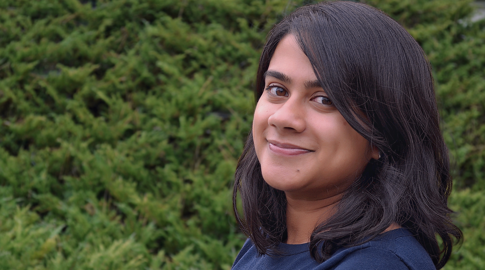

<!-- Global site tag (gtag.js) - Google Analytics -->

I am a PhD Candidate in Political Science at the University of California, Berkeley. I study the political, economic, and social behavior of individuals living in low- and middle-income countries, particularly India. I am also interested in statistics and research methodology.

My dissertation project seeks to understand how welfare programs in developing countries fundamentally change the way in which individuals make demands of the government. This project has been generously supported by the [J-PAL Governance Initiative](https://www.povertyactionlab.org/GI), the [Weiss Family Program Fund in Development Economics](https://projects.iq.harvard.edu/wfrde), the [Institute of International Studies at UC Berkeley](https://iis.berkeley.edu), and the [APSA Centennial Center](https://connect.apsanet.org/centennialcenter/).

Active engagement with policymakers and stakeholders is an important part of my research and dissemination process. Please get in touch if you would like to work on something together!

I hold an MA in Political Science from the University of California, Berkeley and a BA in Government and Economics from Bowdoin College. I expect to receive my PhD in May 2020. 

