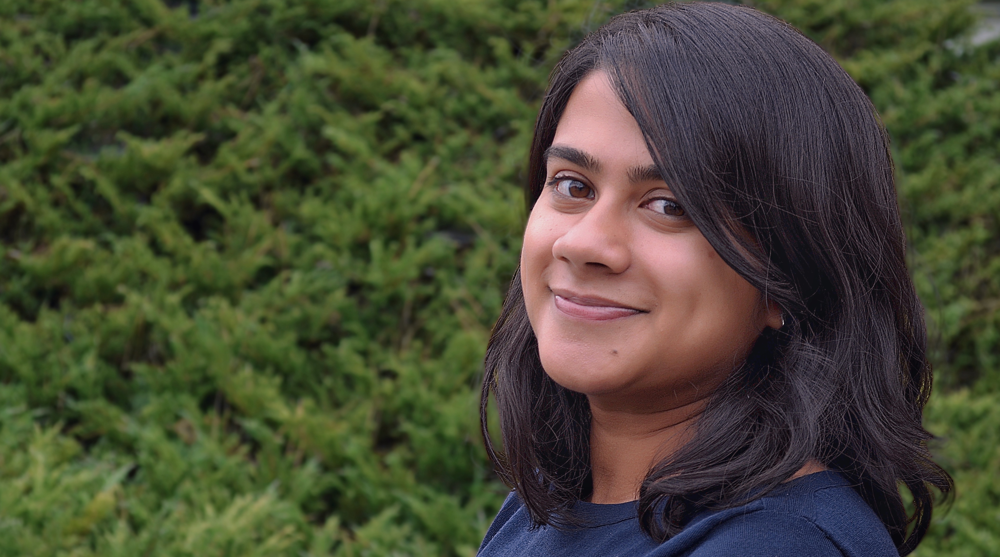

<!-- Global site tag (gtag.js) - Google Analytics -->

I am a PhD Candidate in Political Science at the University of California, Berkeley. I am interested in the determinants of political, economic, and social behavior of individuals living in developing countries, particularly India. I also have an active interest in statistics and research methodology, particularly surrounding issues of field-based research and experiments.

My dissertation project seeks to understand how welfare programs in developing countries fundamentally change the way in which individuals make demands of the government. This project has been generously supported by the [J-PAL Governance Initiative](https://www.povertyactionlab.org/GI), the [Weiss Family Program Fund in Development Economics](https://projects.iq.harvard.edu/wfrde), the [Institute of International Studies at UC Berkeley](https://iis.berkeley.edu), and the [APSA Centennial Center](https://connect.apsanet.org/centennialcenter/).

img.resize{
  max-width:50%;
  max-height:50%;
}

You can pronounce my name THUH-noo or tuh-NOO (like "canoe"), your preference.

I am also an avid distance runner and endurance eater. 

