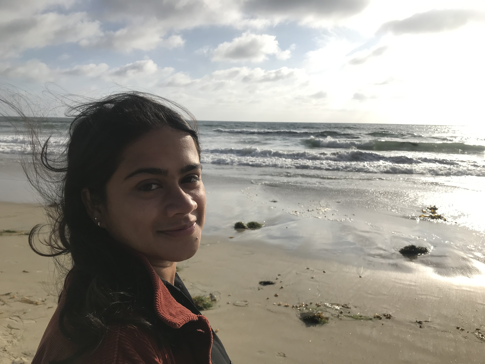

<!-- Global site tag (gtag.js) - Google Analytics -->

I am a postdoctoral fellow at [William & Mary's Global Research Institute](https://www.wm.edu/offices/global-research/). Starting July 2022, I will be an Assistant Professor in the [Division of Politics and Economics](https://www.cgu.edu/school/ssspe/division-of-politics-economics/) at [Claremont Graduate University](https://www.cgu.edu).

I study how policies to house and provide essential services to growing urban populations shape, and are further shaped by, the behavior of citizens and politicians. My policy areas of interest include civic participation, digital technology use, housing, water supply, and gender. My current projects are based in India, Sri Lanka, and Malawi.

Check out some media coverage of my work in [The Washington Post](https://www.washingtonpost.com/news/monkey-cage/wp/2019/01/31/heres-what-gavin-newsom-elizabeth-warren-and-microsoft-should-know-if-want-to-end-the-affordable-housing-crisis/?tid=sm_tw_cage), Ideas for India ([English](https://www.ideasforindia.in/topics/poverty-inequality/household-level-effects-of-affordable-housing-evidence-from-mumbai.html) and [Hindi](https://www.ideasforindia.in/topics/poverty-inequality/household-level-effects-of-affordable-housing-evidence-from-mumbai-hindi.html)), [ThePrint](https://theprint.in/opinion/mumbai-residents-win-govt-housing-lottery-and-spend-more-on-kids-education-jobs-study/290485/), and this [podcast](https://www.discoursemagazine.com/politics/2020/12/24/ideas-of-india-how-does-subsidizing-housing-prices-shape-political-behavior/). 

I completed my PhD in Political Science at the University of California, Berkeley in May 2020. I also studied at Bowdoin College. 

